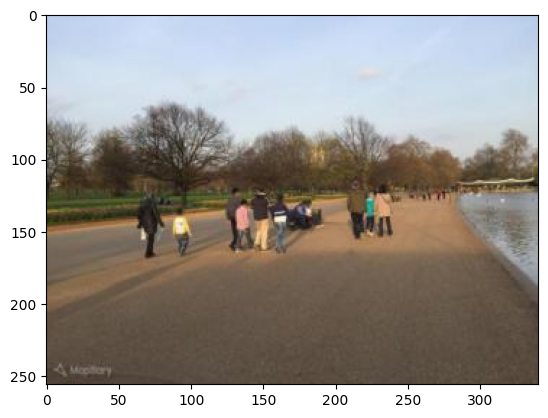
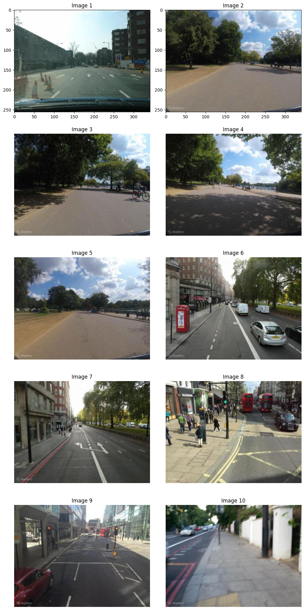

# Image Retrieval with Siamese Networks

This project aims to explore the effectiveness of a **Siamese Neural Network** (SNN) in developing a robust **image retrieval** model by leveraging **image key points**. Through rigorous experimentation and analysis, the project investigates the SNN's capabilities in capturing intricate image similarities and addresses the challenges associated with image retrieval tasks. The achieved performance demonstrates the SNN's potential in enhancing image retrieval accuracy and robustness.

## Research Paper
The comprehensive research paper detailing the methodology, experiments, and findings of this project is included in the repository. Please refer to the [Research Paper](./ResearchPaper.pdf) for an in-depth analysis of the project, including detailed descriptions of the methodologies employed, experimental setups, results, and discussions.

## Method
The project employs a Siamese Neural Network architecture, incorporating image key points for feature extraction and similarity measurement. The network undergoes comprehensive training using a dataset containing image pairs and corresponding relevance scores. Evaluation metrics such as precision at k and accuracy within a relevance score range are utilized to assess the model's performance.

Image Key-point Extraction:

Our Siamese Neural Network Model:

## Results

- The Siamese Neural Network (SNN) achieved a 10-precision of 2%.
- The SNN demonstrated an accuracy of 85.07% in classifying relevant images within a relevance score range of 0.01.
- Manual inspection revealed that between 10 and 50% of the top 10 retrieved images were relevant, while the rest exhibited similar visual features.

### Example:

Image Query:

Images Retrieved:

## Conclusion

Our exploration of using Siamese Neural Networks (SNNs) with key-point extraction for image retrieval suggests that the complexity introduced by this approach may not be justified by the achieved results. While the SNN demonstrated effectiveness in identifying relevant images, the overall performance indicates a need for simplification.

Moving forward, a more streamlined approach involving a simple SNN with convolutional layers is anticipated to yield superior results. This alternative strategy aims to capitalize on the power of convolutional layers for feature extraction while minimizing unnecessary complexities, offering a promising avenue for improved image retrieval accuracy and efficiency.

## Repository Files
- `model.ipynb`: Python notebook script containing the implementation of the Siamese Neural Network and the image retrieval process.
- `process_data.ipynb`: Python notebook script for preprocessing the dataset and extracting image key points.

## License
This project is licensed under the MIT License - see the [LICENSE](LICENSE) file for details.
